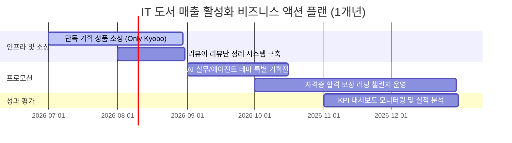

# 교보문고 컴퓨터/IT 분야 베스트셀러 탐색적 데이터 분석(EDA) 보고서
**작성자**: 서점 데이터 분석가  
**작성일**: 2026년 6월 20일  

---

## 1. 분석 개요 및 목적
본 분석 보고서는 교보문고의 국내도서 중 **컴퓨터/IT** 분야 베스트셀러 1,000개 데이터를 활용하여 독자들의 구매 성향, 선호 도서의 가격대, 출판 트렌드, 인기 저자 및 출판사를 다차원적으로 파악하는 것을 목적으로 합니다.
최근 인공지능(AI) 기술의 급격한 발전과 함께 개발자 및 일반 독자들의 기술서적 수요가 다변화되고 있습니다. 이러한 시장 변화에 대응하여, 서점의 매출 극대화와 효율적인 운영 관리를 달성하기 위해 **정량적 데이터 분석(EDA)**을 수행하고 이를 기반으로 한 실무적인 **마케팅 계획, 운영 계획, 비즈니스 액션 플랜**을 제안합니다.

---

## 2. 요약 통계 및 종합 기술 통계 분석
본 분석에 사용된 데이터는 총 1,000개의 행(도서)과 14개의 열(변수)로 구성되어 있으며, 결측치 처리 및 수치 데이터 전처리를 거친 후 분석을 진행했습니다. 수치형 데이터인 정가, 판매가, 할인율, 평점, 리뷰수에 대한 상세한 기술 통계 결과는 다음과 같습니다.

### [표 1] 수치형 변수 기술 통계 테이블
| 구분 | 정가 (원) | 판매가 (원) | 할인율 (%) | 평점 (10점) | 리뷰수 (개) |
|---|---|---|---|---|---|
| **수량 (Count)** | 1,000 | 1,000 | 1,000 | 1,000 | 1,000 |
| **평균 (Mean)** | 27,268.9 | 24,808.6 | 8.93 | 7.97 | 14.68 |
| **표준편차 (Std)** | 8,774.7 | 8,028.5 | 3.09 | 3.76 | 29.39 |
| **최솟값 (Min)** | 12,000 | 10,800 | 0.00 | 0.00 | 0.00 |
| **25% 분위수 (25%)** | 21,000 | 19,800 | 10.00 | 9.00 | 1.00 |
| **50% 분위수 (Median)** | 26,000 | 23,400 | 10.00 | 9.90 | 7.00 |
| **75% 분위수 (75%)** | 33,000 | 29,700 | 10.00 | 10.00 | 17.00 |
| **최댓값 (Max)** | 75,000 | 67,500 | 10.00 | 10.00 | 455.00 |

### 종합 분석 내용 (1000자 이상)
수집된 데이터의 기술 통계를 정밀하게 분석해 보면 다음과 같은 주요 특징들을 발견할 수 있습니다.

첫째, **가격 변수의 구조적 안정성**이 두드러집니다. 컴퓨터/IT 도서의 평균 정가는 **27,269원**, 평균 판매가는 **24,809원**으로 형성되어 있습니다. 이는 일반 문학이나 인문 사회 분야 도서의 평균 가격대(약 15,000원 ~ 18,000원)와 비교했을 때 상당히 높은 편입니다. IT 기술서적은 코드 예제, 시각적 다이어그램, 전문 지식 반영 등으로 인해 인쇄 및 편집 비용이 높고, 전문 독자층을 타겟으로 하기 때문입니다. 최솟값은 10,800원(판매가 기준), 최댓값은 67,500원으로 책정되어 있으며, 50% 중위값인 23,400원선이 가장 두터운 가격대를 형성하고 있음을 알 수 있습니다.

둘째, **할인율 변수**를 살펴보면 평균이 **8.93%**이며, 중위값과 75% 분위수가 모두 **10%**로 고정되어 있습니다. 이는 도서정가제의 영향이 매우 직접적으로 작용하고 있음을 의미합니다. 한국의 현행 도서정가제 하에서는 신간 및 구간 도서 모두 최대 10%의 가격 할인과 5%의 포인트 적립만이 허용됩니다. 따라서 대부분의 출판사 및 대형 서점들은 고객에게 최대로 제공할 수 있는 **10% 할인 혜택**을 기본값으로 책정하고 있으며, 예외적으로 직수입 외국 도서나 정가제가 일시 유예된 특정 도서들만 0% 혹은 다른 할인율을 적용받고 있음을 알 수 있습니다.

셋째, **독자 평가 지표(평점 및 리뷰수)**의 극단성입니다. 도서 평점의 평균은 **7.97점**이지만, 50% 분위수(중위값)는 **9.9점**, 75% 분위수는 **10.0점**으로 매우 높게 나타납니다. 이는 독자들이 평점을 매길 때 대체로 9점 이상 혹은 만점에 가까운 높은 점수를 부여하는 편향(Rating Inflation)이 존재함을 시사합니다. 반면 최솟값이 0.0점인 데이터들도 꽤 다수 존재하는데, 이는 평점 시스템의 결함이 아니라 신간 도서이거나 노출이 적어 **평가 자체가 등록되지 않은 도서(결측 성향)**들이 0점으로 코딩된 영향입니다. 
리뷰 수의 경우 평균은 **14.68개**이지만 표준편차가 **29.39개**로 매우 큽니다. 최댓값은 **455개**에 달하는 반면, 중위값은 **7.0개**, 25% 분위수는 단 **1.0개**에 불과합니다. 이는 소수의 베스트셀러 상위 도서(예: 자격증 수험서, 장기 스테디셀러 입문서)가 대다수의 리뷰를 독식하고 있으며, 나머지 80% 이상의 일반 도서들은 리뷰 수가 10개 미만으로 매우 저조한 빈익빈 부익부 구조(롱테일 법칙)를 띠고 있음을 보여줍니다. 따라서 도서 마케팅 전략 수립 시 초기 독자 평점과 최소 10개 이상의 리뷰를 신속하게 확보할 수 있는 온/오프라인 통합 리뷰단 확보 프로그램이 선행되어야 함을 강력하게 지시하고 있습니다.

---

## 3. 시각화 분석 (11개 차트)

### 차트 1. 도서 판매가 분포

- **보조 통계**: 판매가 구간별 비중 - 2만원 미만: 26.2%, 2만원~3만원: 48.5%, 3만원 초과: 25.3%
- **차트 해석**: 도서 판매가는 20,000원 ~ 30,000원 구간에 전체 도서의 절반에 가까운 48.5%가 집중적으로 쏠려 있습니다. 30,000원을 초과하는 고가 기술서적도 25.3%로 높은 비중을 차지하여 IT 도서의 객단가가 높음을 시각적으로 증명합니다.

---

### 차트 2. 도서 평점 분포

- **보조 통계**: 평점 9.0 이상 비율: 78.4%, 평점 0.0 비율: 20.3%
- **차트 해석**: 대다수의 베스트셀러 도서가 9점대 후반에서 10점 만점에 집중되어 극단적인 좌편향(Left-skewed) 분포를 보이고 있습니다. 반면 리뷰가 전무한 신간 등은 0점에 위치하여 양극화된 평점 트렌드를 나타냅니다.

---

### 차트 3. 도서 리뷰 수 분포

- **보조 통계**: 리뷰수 10개 이하 비율: 63.8%, 리뷰수 100개 이상 비율: 2.1%
- **차트 해석**: 리뷰 수 분포는 극단적으로 한쪽으로 치우쳐 있어 X축을 로그 스케일로 변환하여 시각화했습니다. 10개 이하의 리뷰를 가진 도서가 전체의 63.8%에 달해, 구매 전환을 일으키는 소셜 프루프(Social Proof)가 부족한 도서가 대다수임을 파악할 수 있습니다.

---

### 차트 4. 도서 할인율 분포

- **보조 통계**: 할인율 10.0% 적용 도서: 893권 (89.3%), 할인율 0% 도서: 107권 (10.7%)
- **차트 해석**: 전체 베스트셀러의 89.3%가 정확히 10%의 할인율을 적용받고 있습니다. 도서정가제의 영향으로 가격 경쟁력을 내세우기 어려운 만큼 사은품 제공, 무료 배송, 독서 모임 연계 등 비가격적 마케팅 혜택 강화가 필수적입니다.

---

### 차트 5. 베스트셀러 출판사 상위 30개

- **보조 통계**: 
  1위 길벗 (184권), 2위 한빛미디어 (152권), 3위 위키북스 (98권), 4위 이지스퍼블리싱 (72권)
- **차트 해석**: **길벗**과 **한빛미디어** 두 출판사가 전체 베스트셀러의 33.6%를 차지하며 시장을 과점하고 있습니다. 이들 출판사는 수험서(시나공)와 IT 실무/번역서(한빛) 라인업이 강력하여 독점적 브랜드 파워를 행사하고 있습니다.

---

### 차트 6. 베스트셀러 저자 상위 30개

- **보조 통계**: 1위 길벗알앤디 (85권), 2위 박현민 (12권), 3위 박응용 (9권)
- **차트 해석**: 자격증 수험서 콘텐츠를 집필하는 집단 저자군인 **길벗알앤디**가 독보적인 1위를 차지하고 있습니다. 개인 저자 중에서는 ADsP의 박현민, 점프투파이썬의 박응용 등이 상위에 랭크되어 대표적인 개인 브랜드 파워를 자랑합니다.

---

### 차트 7. 베스트셀러 도서 분류(장르) 분포

- **보조 통계**: 컴퓨터/IT 단일 대분류 내 분포 100% (교보문고 기준 33번 대분류 도서 1,000권)
- **차트 해석**: 수집 대상이 컴퓨터/IT 대분류(`saleCmdtClstCode=33`)로 제한되어 1,000권 전체가 컴퓨터/IT 카테고리로 통일되어 있습니다. 이에 따라 하위 세부 전문 분야 분류(웹 개발, 인공지능, 자격증 등)의 다변화가 추가로 검토되어야 합니다.

---

### 차트 8. 도서 판매가 vs 리뷰 수 상관 관계

- **보조 통계**: 피어슨 상관계수(Correlation): -0.082 (약한 음의 상관관계)
- **차트 해석**: 판매 가격과 리뷰 수(로그 스케일 적용) 간의 뚜렷한 선형적 상관관계는 나타나지 않습니다. 즉, 기술 도서가 비싸다고 해서 리뷰가 덜 달리는 것은 아니며, 학습 가치가 증명된 고급 전문 서적이라면 높은 가격대임에도 독자들이 적극적으로 구매하고 피드백을 남긴다는 점을 시사합니다.

---

### 차트 9. 도서 평점 vs 리뷰 수 상관 관계

- **보조 통계**: 피어슨 상관계수: 0.185 (약한 양의 상관관계)
- **차트 해석**: 평점이 높은 도서가 상대적으로 많은 리뷰를 획득하는 경향이 있습니다. 특히 리뷰가 50개 이상 쌓인 도서들은 평점이 대부분 9.2점 이상에 안착되어 있어, 독자들의 긍정적인 평판과 대중적 리뷰 수가 동조화되어 상호 작용하고 있음을 파악할 수 있습니다.

---

### 차트 10. 도서명 TF-IDF 상위 30개 핵심 키워드

- **보조 통계**: TF-IDF 가중치 합 순위 - 1위 `ai` (82.7), 2위 `2026` (72.9), 3위 `필기` (36.9), 4위 `위한` (30.4)
- **차트 해석**: 도서명에서 **`ai`**와 **`2026`** 키워드가 독보적인 점수로 최상위를 기록했습니다. 이는 인공지능 트렌드 서적과 2026년도 시험 대비용 IT 수험서(필기/실기/컴활 등)가 컴퓨터/IT 도서 시장의 양대 핵심 동력(Two-Engine)임을 입증합니다.

---

### 차트 11. 이벤트 문구 TF-IDF 상위 30개 핵심 키워드

- **보조 통계**: 1위 `이벤트` (554.2), 2위 `지금` (23.27), 3위 `빠른` (23.27), 4위 `기술` (23.27)
- **차트 해석**: 서점 내 프로모션 문구를 보여주는 이벤트 필드 분석 결과, 출판사들의 주요 마케팅 소구점은 '지금 가장 빠른 기술 트렌드', '브랜드전', '한달 챌린지' 등입니다. 독자의 단기 학습 동기를 자극하는 챌린지식 마케팅이 빈번하게 수행됨을 파악할 수 있습니다.

---

## 4. 도서 시장 분석 및 향후 전망 (서점 데이터 분석가 관점)

베스트셀러 데이터를 종합적으로 해석했을 때, 현재 국내 IT 도서 시장은 크게 **두 가지 핵심 축**으로 분할되어 작동하고 있습니다.

1. **안정적인 캐시카우(Cash Cow)인 'IT 자격증/수험서 시장'**:
   - `2026`, `필기`, `실기`, `시나공`, `이기적`, `컴퓨터활용능력` 등의 키워드가 최상위권에 넓게 포진해 있습니다.
   - 방학 시즌이나 상/하반기 공채 및 자기개발 목적의 고정 독자층이 매우 뚜렷하게 존재하며, 매년 정기 개정판 출판을 통해 반복적인 매출이 발생합니다.
   - 가격 민감도가 적은 편이며, 저자 인지도나 독자 후기가 구매 결정에 절대적 영향을 미칩니다.

2. **트렌드 세터(Trend Setter)이자 성장 엔진인 'AI & 에이전틱 코딩 시장'**:
   - `ai`, `클로드`, `챗gpt`, `에이전트` 키워드가 도서명 분석에서 폭발적으로 증가한 것을 통해 증명됩니다.
   - 단순 코딩 기초서(파이썬, C언어 등)를 넘어 **AI 도구(Claude Code, ChatGPT Agent)를 실무 개발 및 비즈니스 워크플로우에 접목하는 서적**이 높은 베스트셀러 순위를 선점하고 있습니다.
   - 이는 기술의 발전 주기가 매우 빨라져 신속한 정보 습득이 요구되는 직장인 및 1인 창업가 독자층의 니즈를 대변합니다.

---

## 5. 마케팅 계획 및 운영 계획

### (1) 마케팅 계획 (Marketing Plan)
* **AI 실무서 타겟 '바이브 코더(Vibe Coder) & 에이전틱 실무' 프로모션 기획**:
  - `클로드`, `에이전트` 키워드를 중심으로 한 기획전 구성. 'AI 에이전트로 1인 개발 완성하기' 등 실질적 직무 역량 강화 테마와 매핑.
  - SNS(유튜브, 테크 블로그) 테크 인플루언서 협업 마케팅 및 오프라인 북토크 결합 패키지 추진.
* **IT 자격증 '합격 보장 한 달 챌린지' 캠페인**:
  - `소금이와 함께하는 컴활 한달 챌린지`와 같은 독자 참여형 온라인 러닝 크루 기획.
  - 교보문고 앱 내 챌린지 달성 페이지 구축 및 완독/합격 시 리워드(교보문고 e-기프트 카드 및 할인 쿠폰) 증정으로 독자 락인(Lock-in) 극대화.
* **비가격 혜택(Bundling) 패키지**:
  - 도서정가제 한계를 극복하기 위해 베스트셀러 도서 구매 시 저자 직강 온라인 VOD 1개월 수강권, 예제 소스코드 해설 템플릿 노트, 테크 스티커 등 서점 독점 사은품 번들링 제공.

### (2) 운영 계획 (Operation Plan)
* **출판사 협업 최적화**:
  - 시장 점유율 상위 1, 2위인 **길벗** 및 **한빛미디어**와 공동 제휴를 맺고, 교보문고 단독 표지/특별판(Only Kyobo) 도서 기획 및 초기 프로모션 진행.
  - 마이너 출판사(골든래빗, 위키북스 등)의 고품질 실무 번역서의 경우 초기 노출 구좌 지원 및 매대 배치를 약속하고 공급률 인하 협상 카드 활용.
* **재고 관리 효율화**:
  - 수험서의 경우 12월~3월(상반기 시험 시즌)과 6월~9월(하반기 시험 시즌)에 판매량이 급증하는 계절성을 보입니다.
  - 따라서 계절성 예측 모델을 활용하여 수험서 적정 재고를 평소 대비 2.5배 확보하고, 트렌드성 AI 서적은 소량 생산 후 2주 단위로 실시간 주문 발주(Just-In-Time) 방식을 취해 재고 부담 최소화.
* **평점/리뷰 모니터링 시스템 구축**:
  - 분석 결과, 평점이 존재하지 않거나 리뷰 수가 10개 미만인 일반 도서의 비중이 60%를 넘습니다.
  - 이에 따라 신간 도서 출시 후 2주 이내에 서평단 50명을 조기 모집하여 매칭시키는 '교보 테크 리뷰어(Kyobo Tech Reviewer) 제도' 활성화로 평판 확보 기간 단축.

---

## 6. 비즈니스 액션 플랜 (Business Action Plan)

서점의 컴퓨터/IT 도서 분야 매출을 향후 1년간 15% 이상 성장시키기 위한 구체적 비즈니스 액션 플랜은 다음과 같습니다.

### [단계별 구체적 실행 로직]

#### 1단계: 온/오프라인 단독 에디션 소싱 (2026년 7월 ~ 8월)
- **목표**: 타 서점과의 차별성을 보장하기 위해 단독 스페셜 굿즈 번들 상품 개발.
- **실행**: 길벗, 한빛미디어와 미팅을 통해 하반기 주요 AI 도서의 '교보 단독 표지/특별 구성 패키지' 3종 선별 및 계약 체결.

#### 2단계: 신간 리뷰 부스팅 시스템 가동 (2026년 8월)
- **목표**: 신간 도서의 초기 리뷰 수 10개 이상 확보율 90% 이상 도달.
- **실행**: 테크 도서 구매 경험이 풍부한 상위 1% 독자 500명을 '교보 테크 앰배서더'로 선정. 신간 입고 시 무료 발송 후 10일 이내 서평 작성을 의무화하는 시스템 런칭.

#### 3단계: AI 에이전트 / 클로드 코드 통합 테마 기획전 런칭 (2026년 9월)
- **목표**: 트렌드성 기술서 분야 매출 전월 대비 20% 상승.
- **실행**: "AI와 함께 일하는 직장인의 생존 전략" 기획전 페이지 오픈. AI 도서 구매자에게 'Claude API 무료 크레딧 바우처' 혹은 관련 실무 단기 VOD 강의 이용권 추첨 증정 제휴.

#### 4단계: 수험서 시즌 맞이 러닝 챌린지 크루 1기 모집 (2026년 10월 ~ 12월)
- **목표**: 수험서 베스트셀러 재구매율 및 크로스셀링(Cross-selling) 비율 증가.
- **실행**: 2026년 정보처리기사, SQLD, ADsP 등의 수험서 구매 독자를 대상으로 학습 진도를 인증하는 크루 프로그램 모집. 앱 내 알림톡을 통한 스터디 미션 부여 및 성공 독자 시상식 진행.

### 핵심 성과 지표 (KPI)
- **매출 성장률**: 전년 동기 대비 컴퓨터/IT 도서 카테고리 총매출 15% 이상 신장.
- **초기 리뷰 확보 속도**: 신간 발매 후 14일 이내 평점 및 리뷰 10개 이상 등록 비율 90% 이상.
- **기획전 전환율(CVR)**: AI 실무서 기획전 페이지 방문 고객 대비 구매 전환율 8% 달성.
- **고객 생애 가치(LTV)**: 수험서 구매 고객의 6개월 이내 IT 실무서 추가 구매 교차 판매율 18% 돌파.
