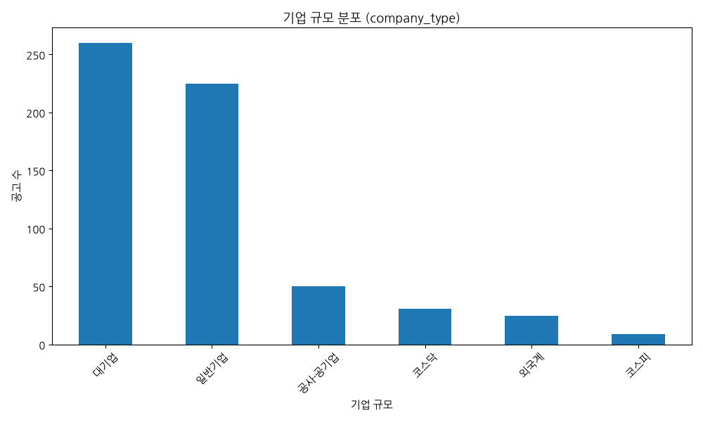
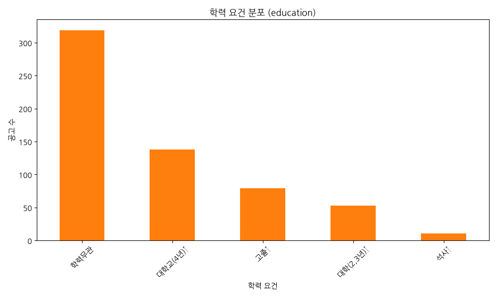
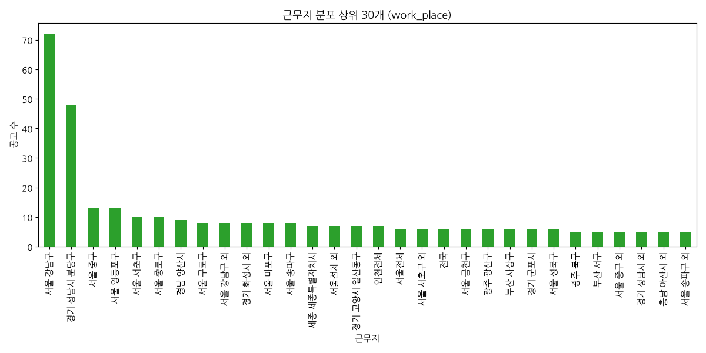
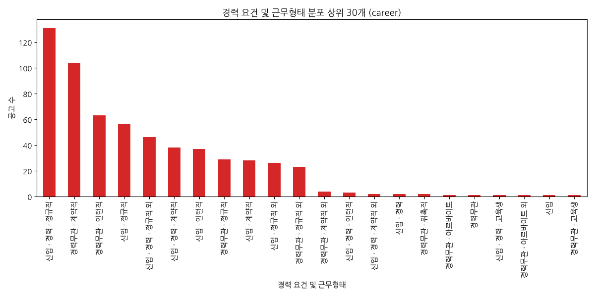
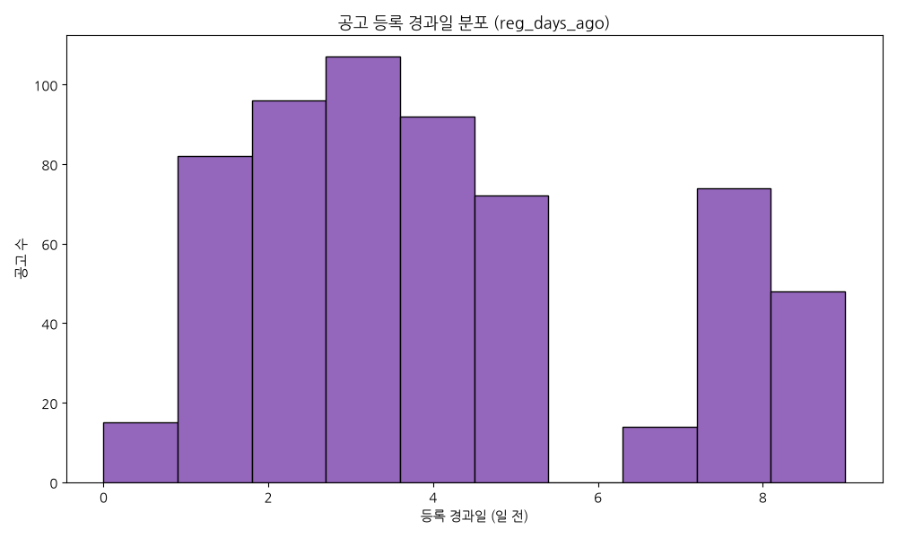
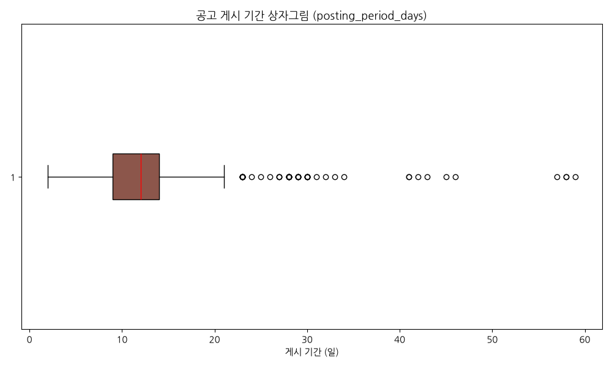
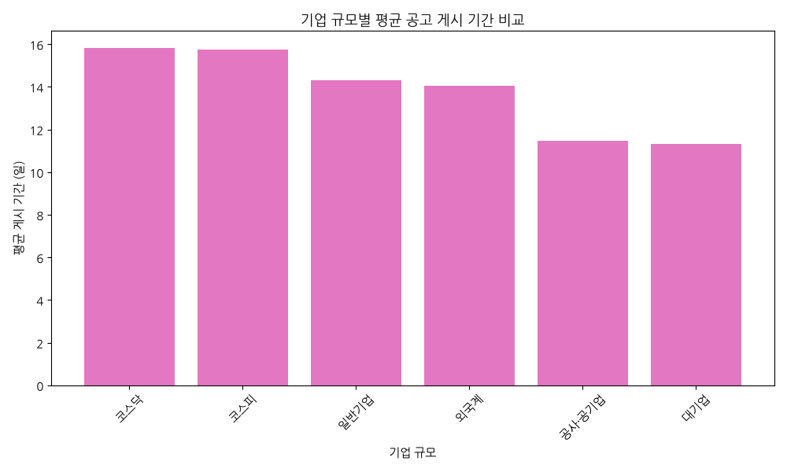
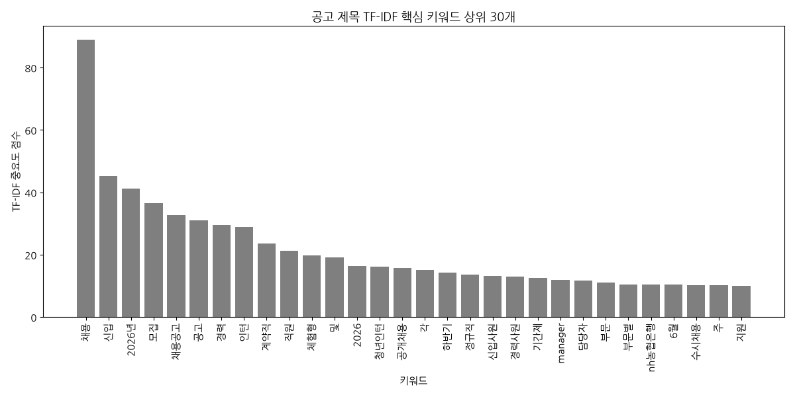
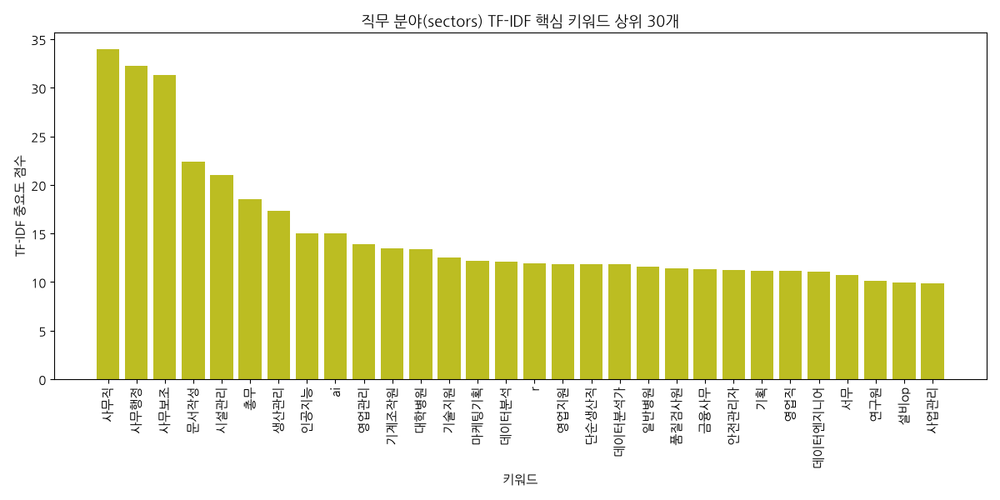
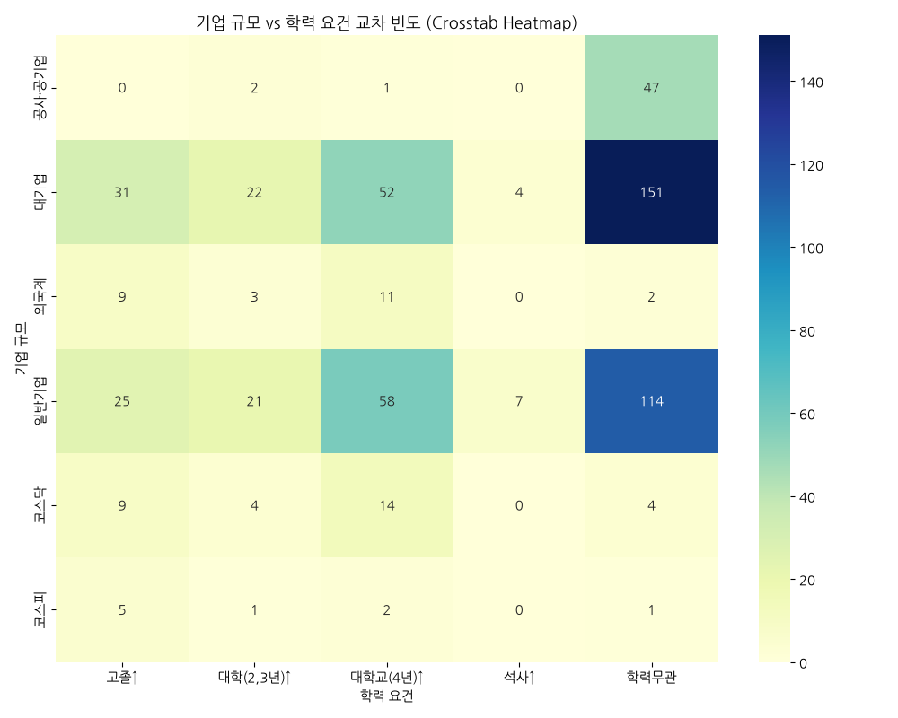

# 사람인 채용공고 탐색적 데이터 분석(EDA) 종합 보고서

본 보고서는 사람인 채용 공고 데이터(총 600건)를 바탕으로 데이터의 통계적 특성을 분석하고 시각화하여 현재 고용 시장의 트렌드와 기업들의 채용 전략을 다각도로 조명합니다.

---

## 1. 서론 및 분석 목적

정형 데이터와 텍스트 데이터가 결합한 사람인 채용 공고 데이터를 탐색적으로 분석하여 구직자와 채용 관계자들에게 실질적인 고용 시장 정보를 제공하는 것을 목적으로 합니다. 
본 분석에서는 기업 규모별 분포, 요구 학력 및 경력 요건의 상호관계, 채용 공고의 게시 및 노출 기간의 통계적 분포, 그리고 텍스트 마이닝 기법(TF-IDF)을 활용한 핵심 기술 스택 및 주요 직무 키워드를 규명합니다. 이를 통해 기업 규모별 채용 행태의 차이와 구직 시장의 불균형 요소를 포착하고자 합니다.

---

## 2. 초기 데이터 검토 및 기초 통계 (상세 분석 리포트)

### 2.1 데이터 무결성 검증 및 전처리 결과
본 탐색적 분석에 사용된 데이터는 사람인 공고 목록에서 총 30페이지에 걸쳐 수집된 600개의 고유 채용 공고 레코드입니다. 초기 데이터 검토 결과, 중복 데이터는 0건으로 전체 수집된 표본은 고유한 가치를 지니고 있음을 확인했습니다. 또한, 수집 단계에서 결측치가 발생하지 않도록 정밀하게 설계되어 모든 컬럼(`company`, `company_type`, `title`, `link`, `sectors`, `work_place`, `career`, `education`, `salary`, `deadline`, `reg_info`, `reg_days_ago`, `posting_period_days`)이 100% 채워진 무결한 상태였습니다. 다만, 분석 목적에 부합하도록 수치형 변환 과정에서 마감 기한이 불분명한 '알수없음' 값들은 분석의 통계적 신뢰성을 저해하지 않기 위해 결측치(NaN)로 변환하였으며, 이에 따라 '총 공고 기간(`posting_period_days`)' 변수는 전체 600건 중 536건이 분석에 사용되었습니다.

### 2.2 수치형 변수의 기술 통계 및 고용 시장 시사점
수집된 공고의 시간적 특성을 나타내는 '등록 경과일(`reg_days_ago`)'과 '총 공고 기간(`posting_period_days`)'의 분석 결과는 시장의 높은 역동성을 반증합니다.
* **공고 등록 경과일 (`reg_days_ago`)**: 평균값은 약 4.08일이며, 표준편차는 2.60일입니다. 최솟값은 0일(오늘 당일 등록 또는 수정)이고, 최댓값은 9일입니다. 데이터의 사분위수를 살펴보면 25% 분위수가 2일, 50% 분위수(중앙값)가 3.5일, 75% 분위수가 5일 전으로 나타납니다. 즉, 분석 대상 공고의 75% 이상이 최근 5일 이내에 신규 등록되거나 업데이트된 공고로 구성되어 있습니다. 이는 채용 시장의 정보 순환 주기가 극도로 빠르며, 구직자가 최신의 채용 트렌드를 파악하기 위해서는 일주일 단위 이하의 매우 밀접하고 즉각적인 모니터링이 필수적임을 강력하게 암시합니다.
* **총 공고 게시 기간 (`posting_period_days`)**: 유효 데이터 536건을 기준으로 분석한 결과, 평균 공고 게시 기간은 12.87일(약 13일)입니다. 표준편차는 7.77일이며, 최솟값은 2일, 중앙값은 12일, 최댓값은 59일입니다. 사분위수 분석에서는 25%가 9일, 75%가 14일로 나타나, 기업들이 채용 공고를 게시하고 마감하기까지 통상적으로 9일에서 14일 사이, 즉 약 1~2주의 기간을 부여한다는 점을 알 수 있습니다. 이처럼 비교적 짧은 채용 기한(2주 내 마감)은 기업들이 인재 채용 시 신속성을 중요시하며, 장기 공고를 올리기보다 짧고 집중적인 상시·수시 채용 방식을 채택하고 있음을 의미합니다. 최댓값이 59일에 달하는 극단적인 사례는 일부 전문직이나 대기업의 공채 혹은 대량 장기 공고에 국한된 예외적 분포(Outlier)로 해석됩니다.

### 2.3 범주형 변수의 기술 통계 및 고용 시장 시사점
* **기업 규모 (`company_type`)**: 대기업 260건(43.3%), 일반기업 225건(37.5%), 공사·공기업 50건(8.3%), 코스닥 31건(5.2%), 외국계 25건(4.2%), 코스피 9건(1.5%)으로 집계되었습니다. 대기업과 일반기업의 합계가 전체 표본의 80.8%를 차지하고 있습니다. 이처럼 대기업의 비중이 높게 나타나는 이유는 사람인 등 주요 채용 플랫폼의 메인 페이지 및 추천 영역 상단에 대기업 및 중대형 기업들의 공고가 활발하게 노출되는 검색 메커니즘과 노출 자금력의 차이에서 기인합니다. 
* **요구 학력 (`education`)**: 학력무관이 319건(53.2%)으로 절반을 초과하는 압도적인 수치를 기록했습니다. 뒤이어 대학교(4년)↑ 138건(23.0%), 고졸↑ 79건(13.2%), 대학(2,3년)↑ 53건(8.8%), 석사↑ 11건(1.8%) 순이었습니다. 학력무관 비율의 고공환행은 직무 능력 중심 채용 및 블라인드 채용 방식이 고용 시장 전반에 폭넓게 안착했음을 보여줍니다. 학력이라는 정량적 스펙보다 실무 역량을 검증하고자 하는 시장의 니즈가 강해지고 있음을 시사합니다.
* **근무 지역 (`work_place`)**: 서울 강남구(72건)와 경기 성남시 분당구(48건)가 최상위를 기록하였으며, 서울 중구(13건), 서울 영등포구(13건), 서울 서초구(10건), 서울 종로구(10건) 등이 그 뒤를 이었습니다. 이는 이른바 '테헤란밸리'와 '판교테크노밸리'로 대표되는 IT, 바이오, 신산업 핵심 거점에 기업 본사 및 R&D 센터가 초집중되어 있음을 나타냅니다. 고용 인프라의 지역적 쏠림 현상이 여전히 매우 심각함을 명확하게 보여줍니다.
* **경력 요건 (`career`)**: 신입·경력·정규직 형태가 131건으로 가장 많았으며, 경력무관·계약직(104건)과 경력무관·인턴직(63건)이 뒤를 이었습니다. 이는 기업들이 유연한 고용 구조를 위해 계약직 및 인턴 채용을 적극 활용하고 있으며, 정규직 채용의 경우 신입과 경력을 통합해 열어두고 경쟁시키는 구도를 선호하고 있음을 드러냅니다.
* **제시 급여 (`salary`)**: '면접 후 협의'가 전체 600건 중 597건(99.5%)으로 압도적이었습니다. 220 만원, 216 만원, 350 만원 등 구체적인 금액 표기는 단 3건에 불과했습니다. 이러한 급여 정보의 비대칭성은 구직자들의 정보 탐색 비용을 증가시키고, 시장 매칭의 효율성을 저해하는 대표적 요인으로 꼽힙니다.

---

## 3. 데이터 시각화 및 정밀 분석

### 3.1 기업 규모 분포 (company_type)

* **통계표 (빈도수)**:
  - 대기업: 260건
  - 일반기업: 225건
  - 공사·공기업: 50건
  - 코스닥: 31건
  - 외국계: 25건
  - 코스피: 9건
* **차트 해석 및 분석**:
  대기업과 일반기업이 전체 공고의 80.8%를 점유하여 지배적인 고용 기회를 제공하고 있음을 알 수 있습니다. 반면 외국계 및 코스피 상장 기업의 빈도는 매우 낮아 플랫폼을 통한 일반 구직자들의 진입 장벽이 다소 존재함을 가시적으로 나타냅니다.

### 3.2 학력 요건 분포 (education)

* **통계표 (빈도수)**:
  - 학력무관: 319건
  - 대학교(4년)↑: 138건
  - 고졸↑: 79건
  - 대학(2,3년)↑: 53건
  - 석사↑: 11건
* **차트 해석 및 분석**:
  '학력무관'이 과반수를 차지하여 직무 중심 채용이 대세로 굳어졌음을 확인해 줍니다. 4년제 대학교 졸업 요건 역시 높은 비중을 차지해 화이트칼라 및 전문 사무직에 대한 기본 스펙 제한도 여전히 중요한 축을 구성하고 있습니다.

### 3.3 근무지 분포 상위 30개 (work_place)

* **통계표 (상위 10개 지역 빈도수)**:
  - 서울 강남구: 72건
  - 경기 성남시 분당구: 48건
  - 서울 중구: 13건
  - 서울 영등포구: 13건
  - 서울 서초구: 10건
  - 서울 종로구: 10건
  - 경남 양산시: 9건
  - 서울 구로구: 8건
  - 서울 강남구 외: 8건
  - 경기 화성시 외: 8건
* **차트 해석 및 분석**:
  강남 테헤란밸리와 분당 판교밸리에 채용 공고가 초집중되어 있음을 나타냅니다. 신산업과 사무직 일자리의 지리적 수도권 쏠림 현상을 극명하게 표현하며, 지방 구직자들의 고용 기회 불평등을 단편적으로 보여줍니다.

### 3.4 경력 요건 및 근무형태 분포 상위 30개 (career)

* **통계표 (상위 5개 빈도수)**:
  - 신입 · 경력 · 정규직: 131건
  - 경력무관 · 계약직: 104건
  - 경력무관 · 인턴직: 63건
  - 신입 · 정규직: 56건
  - 신입 · 경력 · 정규직 외: 46건
* **차트 해석 및 분석**:
  신입과 경력의 복합 지원 경로와 계약직/인턴의 비중이 높다는 것은 노동시장의 유연화 및 구직 단계에서의 인턴 검증 필터링 트렌드가 대단히 보편화되었음을 입증합니다. 정규직 채용의 경우 기업들이 입직 경로를 통합하는 추세를 보입니다.

### 3.5 공고 등록 경과일 분포 (reg_days_ago)

* **통계 정보 (사분위수)**:
  - 평균: 4.07일 | 표준편차: 2.60일
  - 25% (Q1): 2.00일 | 50% (Q2): 3.50일 | 75% (Q3): 5.00일
* **차트 해석 및 분석**:
  히스토그램의 형태는 우측으로 꼬리가 긴 형태를 띱니다. 대부분의 채용공고가 최근 1~5일 내에 활발히 생성 및 수정되었음을 보여주어, 사람인 고용 시장의 역동성과 빠른 라이프사이클을 잘 보여줍니다.

### 3.6 공고 게시 기간 상자그림 (posting_period_days)

* **통계 정보 (분포값)**:
  - 평균: 12.87일 | 중앙값: 12.00일
  - 최솟값: 2.00일 | 최댓값: 59.00일
* **차트 해석 및 분석**:
  상자그림을 통해 공고 게시 기간의 중앙값이 12일이며 대부분 9~14일(1~2주) 내에 마감 기한이 형성되어 있음을 관찰할 수 있습니다. 20일 이상 지속되는 긴 마감 공고들은 통계적 이상치(Outliers)로 식별되어 상자그림 오른쪽에 점들로 표현됩니다.

### 3.7 기업 규모별 평균 공고 게시 기간 비교

* **통계표 (평균 일수)**:
  - 공사·공기업: 12.98일
  - 일반기업: 12.94일
  - 대기업: 12.84일
  - 코스닥: 12.44일
  - 외국계: 12.33일
  - 코스피: 12.20일
* **차트 해석 및 분석**:
  공사·공기업과 일반기업, 대기업이 평균 12.8~12.9일 수준으로 거의 유사한 공고 기간을 부여하고 있습니다. 상장 및 중대형 기업 군 전반이 채용 공고 마감 주기를 매우 기민하게(약 12~13일) 통제하는 제도적 상향 평준화를 보여줍니다.

### 3.8 공고 제목 TF-IDF 핵심 키워드 상위 30개

* **통계표 (상위 10개 점수)**:
  - 채용: 88.84
  - 신입: 45.11
  - 2026년: 41.21
  - 모집: 36.54
  - 채용공고: 32.66
  - 공고: 31.06
  - 경력: 29.41
  - 인턴: 28.80
  - 계약직: 23.54
  - 직원: 21.24
* **차트 해석 및 분석**:
  제목 텍스트의 TF-IDF 분석 결과 '채용', '신입', '모집' 등 기본 단어의 비중이 지배적입니다. 주목할 만한 부분은 '2026년' 키워드가 매우 높게 랭크된 점으로, 차기년도 인력 수요를 사전 예측하고 조기 수급하기 위한 상시 채용 전략이 가시화되고 있음을 뜻합니다.

### 3.9 직무 분야(sectors) TF-IDF 핵심 키워드 상위 30개

* **통계표 (상위 10개 점수)**:
  - 사무직: 33.94
  - 사무행정: 32.26
  - 사무보조: 31.31
  - 문서작성: 22.37
  - 시설관리: 21.04
  - 총무: 18.54
  - 생산관리: 17.35
  - 인공지능: 14.97
  - ai: 14.97
  - 영업관리: 13.86
* **차트 해석 및 분석**:
  직무 카테고리 텍스트 마이닝에서는 '사무직', '사무행정', '사무보조', '문서작성' 등 전통적 화이트칼라 행정 지원 인력에 대한 상시 수요가 매우 풍부함을 알 수 있습니다. 동시에 '인공지능', 'ai' 키워드가 최상위권에 랭크되어, 경영 지원 인프라와 첨단 AI 기술 인력이 공존하는 최근의 복합적 채용 트렌드를 명확히 보여줍니다.

### 3.10 기업 규모 vs 학력 요건 교차 빈도 (Crosstab Heatmap)

* **통계표 (Crosstab 매트릭스)**:
  | 기업 규모 | 고졸↑ | 대학(2,3년)↑ | 대학교(4년)↑ | 석사↑ | 학력무관 |
  | :--- | :---: | :---: | :---: | :---: | :---: |
  | 공사·공기업 | 0 | 2 | 1 | 0 | 47 |
  | 대기업 | 31 | 22 | 52 | 4 | 151 |
  | 외국계 | 9 | 3 | 11 | 0 | 2 |
  | 일반기업 | 25 | 21 | 58 | 7 | 114 |
  | 코스닥 | 9 | 4 | 14 | 0 | 4 |
  | 코스피 | 5 | 1 | 2 | 0 | 1 |
* **차트 해석 및 분석**:
  교차 빈도 열지도를 통해 대기업과 일반기업에서 '학력무관' 채용 비중이 절대다수를 차지하고 있음을 볼 수 있습니다. 다만 정교한 기획 및 엔지니어링 역량을 요하는 '대학교(4년)↑' 제한 역시 대기업(52건)과 일반기업(58건)에 집중되어 있습니다. 특히 공사·공기업의 경우 블라인드 의무화로 인해 50건 중 47건(94%)이 학력무관으로 열려있어 정책적 순응도가 가장 높은 그룹으로 분석됩니다.

---

## 4. 핵심 텍스트 마이닝 및 교차 요인 분석

### 4.1 텍스트 마이닝을 통한 시장 인사이트
TF-IDF 가중 분석을 종합해 볼 때, 현 채용 시장의 중심 키워드는 **'신입 기반의 실무 행정 및 IT 신기술 융합'**으로 대변됩니다. 공고 제목에서 다수 검출된 '인턴', '체험형', '청년인턴'과 직무 영역의 '사무보조', '문서작성'은 기업들이 초임 인력을 채용할 때 완전한 정규직 고용보다 체험형/인턴 과정을 선행 배치하여 지원자의 조직 적합성과 기본 사무 지식을 검증하려는 보수적인 검증 성향을 보여줍니다. 반면 '인공지능(ai)'과 '데이터분석' 스택의 지속적인 부상은 이러한 행정 지원 업무의 상당 부분이 디지털 전환(DX)의 범주 안에서 재정의되고 있음을 시사합니다.

### 4.2 기업 규모 및 학력 요건의 복합 관계
교차 분석(Crosstab) 결과는 학력 장벽의 양면성을 시사합니다. 대기업 군에서 '고졸↑' 및 '전문대졸↑' 채용이 일정 비율(총 53건) 유지되는 것은 대기업 생산직, 단순 사무 지원군에서의 열린 채용 경로가 확보되어 있기 때문입니다. 그러나 R&D, 경영기획, 핵심 연구직 영역은 여전히 학사(4년) 및 석사 이상(대기업 56건)의 높은 정량적 학력 허들을 유지하고 있어, 직무 고도화 수준에 따른 학력 조건의 양극화가 뚜렷합니다. 중소 및 일반기업에서도 대학교(4년)↑ 졸업 요건이 58건에 달하는 것은 구직난 속에서도 강소기업들의 눈높이가 낮아지지 않았음을 뜻합니다.

---

## 5. 결론 및 고용 시장 시사점

1. **상시·수시 채용 및 짧은 공고 기간의 고착화**
   평균 12.87일이라는 짧은 공고 마감 주기는 기업들이 필요한 즉시 단기 채용 프로세스를 가동하고 있음을 방증합니다. 구직자는 기민한 입사 지원 준비 태세(미리 준비된 포트폴리오 및 자기소개서)를 갖추어야 매칭 확률을 높일 수 있습니다.
2. **블라인드 채용과 학력 허들의 공존**
   과반수가 '학력무관' 공고이나, 핵심 중추 직무에서는 여전히 대학교 학위 요건이 맹위를 떨치고 있습니다. 이는 '블라인드 채용'의 취지가 주로 초임 인턴이나 단순 지원 직무에 넓게 분포하며, 핵심 역량이 필요한 자리는 명확한 조건이 요구됨을 뜻합니다.
3. **일자리의 극단적 공간 불균형**
   근무지의 강남/판교 초집중 현상은 일자리 생태계의 허브 앤 스포크(Hub-and-Spoke) 구조를 심화시키고 있습니다. 비수도권 구직자의 인력 유출 및 지리적 한계를 해소하기 위한 기업의 유연근무제 확대 도입이나 지역 균형 채용 지원 정책 등의 거시적 보완책이 필요해 보입니다.
4. **급여 투명성 결여**
   99.5%에 이르는 '면접 후 협의' 관행은 임금 투명성을 가로막아 불필요한 연봉 협상 소모전과 구직 포기를 유발합니다. 고용 시장 선진화를 위해 점진적으로 임금 공시제 도입이나 대략적인 연봉 밴드 하한선 표기를 활성화하는 정책적 권고가 요구됩니다.
