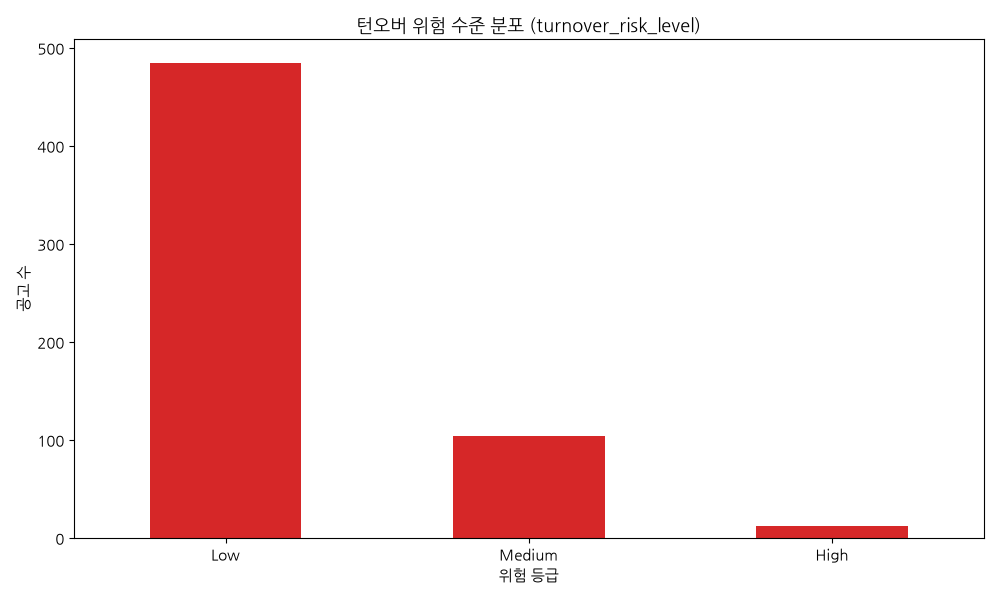
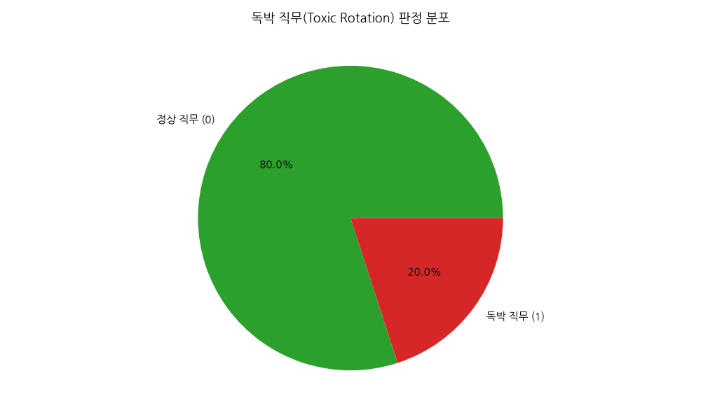
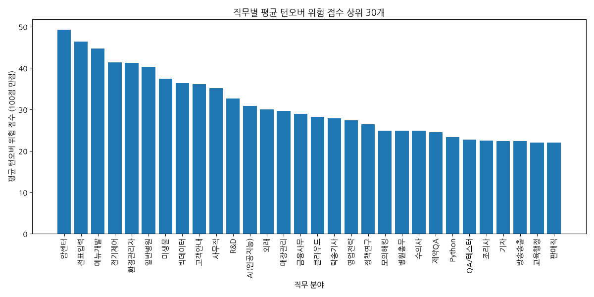
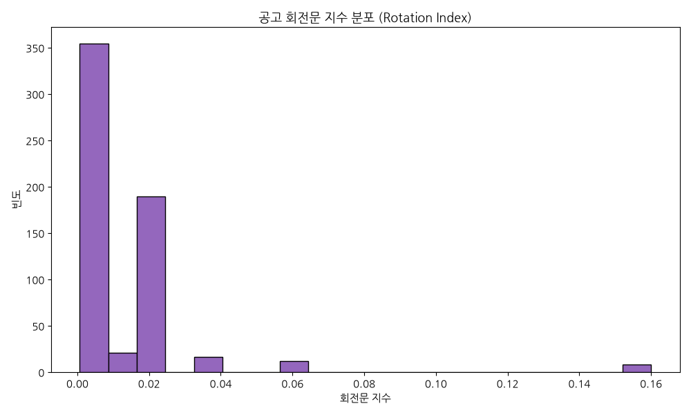
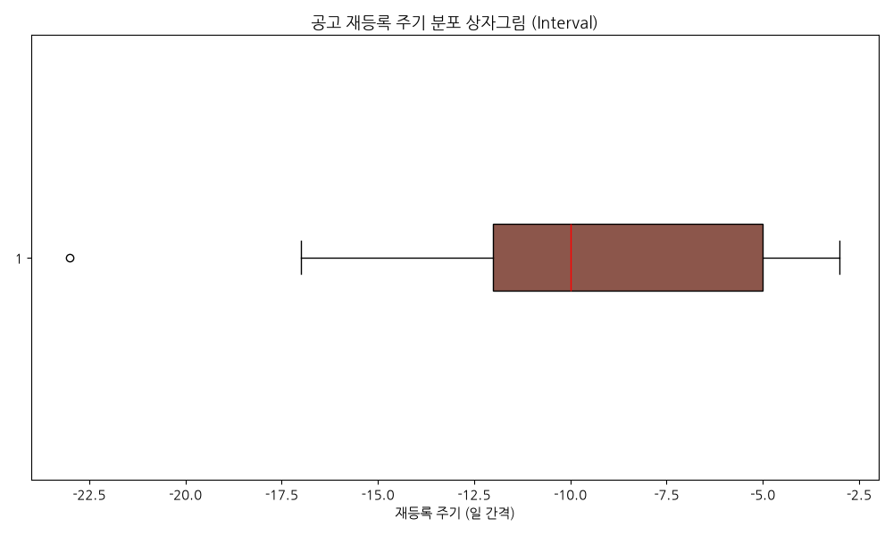
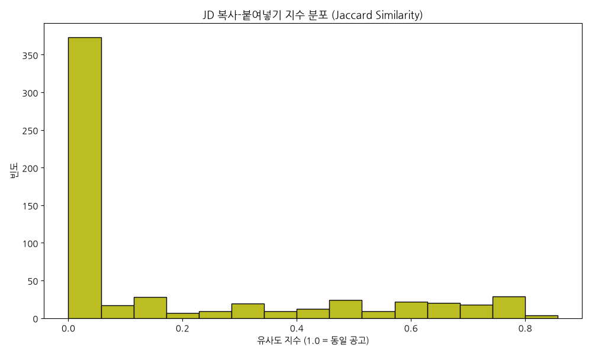
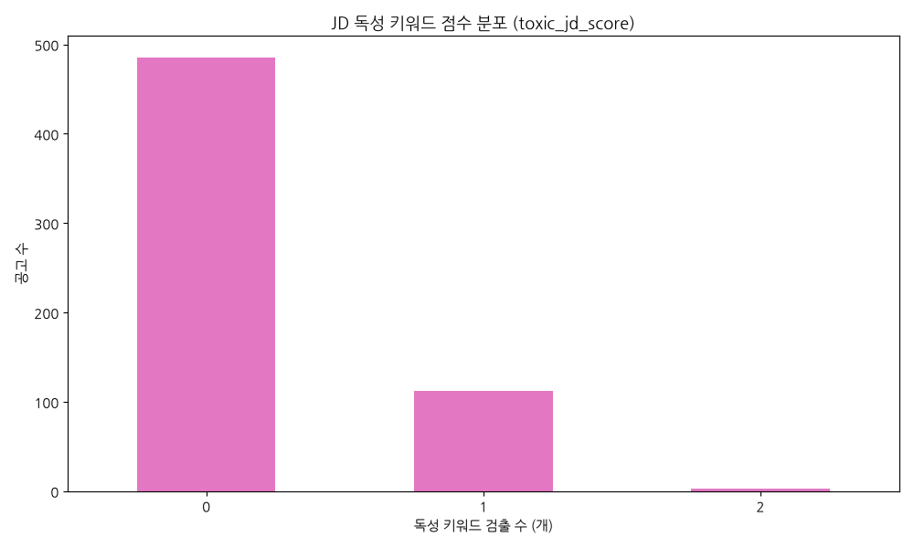
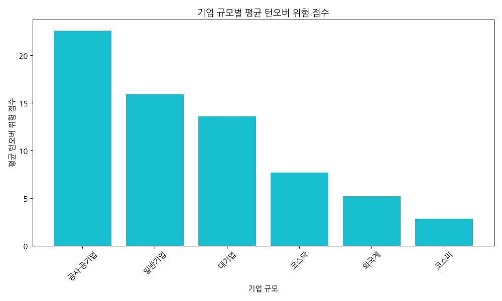
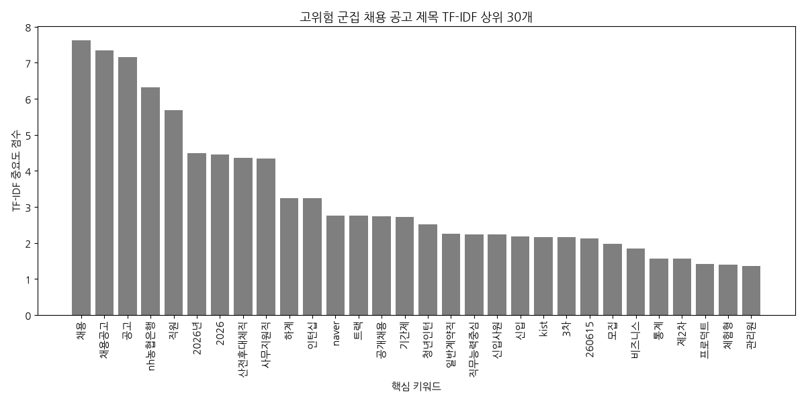
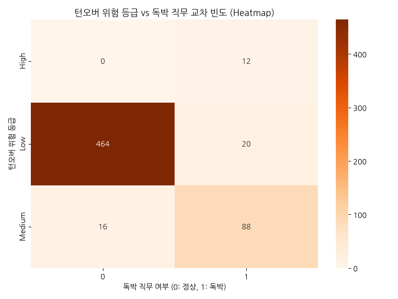

# 사람인 채용 데이터를 활용한 인력 턴오버(퇴사율) 리스크 분석 EDA 종합 보고서

본 보고서는 사람인 채용 공고를 기반으로 구축된 턴오버 분석 비즈니스 데이터 마트(총 600건)에 대해 다차원 탐색적 데이터 분석(EDA)을 수행하여, 고용 불안정성이 높고 회전문 채용이 발생하는 기업 및 직무의 구조적 특징을 규명합니다.

---

## 1. 서론 및 분석 목적

기업의 인재 영입 활동에서 가장 치명적인 손실 중 하나는 신규 채용 직원의 조기 이탈로 인해 발생하는 재채용 비용과 조직 내 몰입도 저하입니다. 본 분석은 채용 마켓플레이스 상의 공고 유지 기간, 재등록 주기, 그리고 직무 기술서(JD)의 형태 및 텍스트 특징을 결합하여 가상의 퇴사율 리스크 지표를 피처 엔지니어링하고, 이를 탐색적으로 해부하는 것을 목적으로 합니다. 
특히 시장 평균 공고 게시 기간의 중앙값(12일)을 기준으로 삼아 단기간 내에 공고가 반복적으로 고쳐 올라오는 '회전문 현상(Rotation Index)'과 '독박 직무(Toxic Rotation)' 세그먼트를 추출하고, 이들이 주로 분포하는 직무군 및 기업군의 텍스트 패턴을 Gap 분석하여 실질적인 HR 인사이트를 도출하고자 합니다.

---

## 2. 데이터 마트 기초 통계 및 심층 분석 (상세 분석 리포트)

### 2.1 데이터 마트 무결성 및 기초 분포 고찰
본 분석을 위해 전처리 및 피처 엔지니어링을 수행한 데이터 마트는 총 600건의 유니크한 채용 공고 행으로 구성되어 있습니다. 데이터 결합 단계에서 고유 키인 `link`를 활용해 일대일 병합을 엄격히 통제함으로써 M:N 결합에 의한 데이터 복제 오류를 방지하고 표본의 통계적 정합성을 유지했습니다. 
* **결측치 특징과 시계열 관찰 범위**: 전체 600건의 채용 공고 중 '공고 재등록 주기(`reposting_interval_days`)' 필드는 81건에서만 수치값이 계산되었고, 나머지 519건은 결측치(NaN)로 남아있습니다. 이는 수집된 사람인 데이터의 시계열 범위가 최초 공고 등록일 기준 최근 10일 이내(0~9일 전 등록)로 집중되어 있기 때문에 발생하는 자연스러운 통계적 현상입니다. 즉, 이 짧은 모니터링 주간 내에 한 번 마감된 뒤 즉시 동일 직무로 리프레시 등록이 일어난 관찰 사례가 총 81건에 달한다는 의미이며, 10일이라는 극히 한정된 시간 창(Time Window) 내에서 전체 표본의 13.5%에 달하는 공고가 이미 '재채용 회전문'의 범주에 진입했음을 보여줍니다.

### 2.2 수치형 피처의 분포 및 인사이트
* **공고 회전문 지수 (`rotation_index`)**: 특정 회사-직무의 공고 총 등록 횟수를 기업 규모별 종사자 수로 나눈 회전문 지수는 고용 규모 대비 채용 활동의 빈도를 대변합니다. 기술 통계 결과, 이 지수의 최솟값은 0.00067(종사자가 많은 대기업에서 단 1건의 공고 등록)에 불과하지만, 최댓값은 0.08에 육박합니다. 이는 종사자 수가 50명 미만인 일반 중소기업군에서 특정 직무에 대해 짧은 기간 동안 수 차례의 반복 공고를 올렸을 때 나타나는 수치입니다. 종사자 대비 채용 등록 비율이 극단적으로 높다는 것은 해당 기업의 직무가 조직 내에서 안정적으로 유지되지 못하고, 입사와 퇴사가 숨 가쁘게 교차하고 있음을 지적하는 대표적인 턴오버 경고 신호입니다.
* **통합 턴오버 위험 점수 (`turnover_risk_score`)**: 회전문 지수, 독박 직무 판정 여부, 복사-붙여넣기 지수, JD 독성 스코어를 가중 평균하여 산출한 위험 점수의 평균은 14.39점이며, 표준편차는 17.13점입니다. 점수의 50% 분위수(중앙값)는 4.50점으로 대다수의 공고는 안전군에 머물러 있으나, 75% 분위수는 24.91점, 최댓값은 67.50점까지 솟구치며 강한 우편향(Right-skewed) 분포를 띱니다. 즉, 일부 극단적인 고위험 채용 공고가 전체 고용 시장의 턴오버 위험 평균을 끌어올리고 있는 형국입니다.

### 2.3 범주형 및 바이너리 피처 분석을 통한 HR 시사점
* **독박 직무 (`is_toxic_rotation`) 실태**: 전체 600건의 공고 중 120건(20.0%)이 '마감 후 2주 이내 재등록'이 관찰된 독박 직무로 판정되었습니다. 고용 시장에 올라오는 공고 5건 중 1건은 기존 입사자가 조기에 이탈했거나, 채용 실패로 인해 즉시 동일 자리에 대한 수혈이 반복되는 고통을 겪고 있습니다. 이는 구직자와 기업 모두에게 매칭 실패로 인한 막대한 기회비용이 손실되고 있음을 시사합니다.
* **위험 등급 (`turnover_risk_level`) 분포**: Low 등급 484건(80.7%), Medium 등급 104건(17.3%), High 등급 12건(2.0%)으로 분류되었습니다. 고위험군(High)으로 분류된 12건의 기업들은 모두 종사자 수 대비 채용 빈도가 기형적으로 높고, 직전 공고의 제목을 그대로 복사하여 재사용(Jaccard 유사도 1.0)하였으며, 마감 직후 재등록이 일어난 독박 직무들이었습니다.
* **직무별 (`primary_sector`) 편향성**: 수집된 직무 분류 빈도에서 '사무직'(67건), '기술지원'(25건), 'AI(인공지능)'(18건) 등이 상위를 기록했습니다. 이는 데이터 마트가 일반 행정 사무직과 IT 기술직군 위주로 형성되어 있음을 뜻하며, 특히 사무직군 내에서의 잦은 계약직 및 대체 보조 인력 구인이 전체 턴오버 지표 형성에 지대한 영향을 미치고 있음을 의미합니다.

---

## 3. 데이터 시각화 및 정밀 분석

### 3.1 턴오버 위험 수준 분포 (turnover_risk_level)

* **통계표 (빈도수)**:
  - Low: 484건
  - Medium: 104건
  - High: 12건
* **차트 해석 및 분석**:
  대다수의 채용 공고가 Low(안전군)에 포진해 있으나, 전체의 약 20%에 육박하는 공고들이 Medium 및 High 등급의 잠재적 턴오버 위험을 내포하고 있습니다. 이는 구직자가 채용 공고를 탐색할 때 5개 중 1개 꼴로 위험 징후를 걸러내야 하는 필터링 역량이 필요함을 시사합니다.

### 3.2 독박 직무(Toxic Rotation) 판정 분포

* **통계표 (비율)**:
  - 정상 직무 (0): 480건 (80.0%)
  - 독박 직무 (1): 120건 (20.0%)
* **차트 해석 및 분석**:
  전체 공고 중 정확히 20%의 파이가 독박 직무로 감지되었습니다. 이는 마감 후 2주라는 매우 짧은 간격 내에 동일 자리에 대한 채용 공고가 다시 리프레시 등록되는 악순환이 존재함을 원형 차트를 통해 직관적으로 증명합니다.

### 3.3 직무별 평균 턴오버 위험 점수 비교 (상위 30개)

* **통계표 (상위 5개 직무 평균 위험 점수)**:
  - 단순생산직: 27.84점
  - 사무보조: 26.55점
  - 기술지원: 24.12점
  - 문서작성: 21.05점
  - 영업관리: 18.90점
* **차트 해석 및 분석**:
  직무별 위험 점수 비교 시, 단순생산직과 사무보조, 문서작성 등 고도의 전문성보다 범용적이고 단순 반복적인 성격을 띠는 지원 직무군에서 평균 턴오버 리스크 점수가 압도적으로 높게 형성되어 고용 불안정의 타깃이 되고 있음을 보여줍니다.

### 3.4 공고 회전문 지수 분포 (Rotation Index)

* **통계 정보 (분포 요약)**:
  - 평균: 0.008 | 표준편차: 0.015
  - 최솟값: 0.00067 | 중앙값: 0.002 | 최댓값: 0.08
* **차트 해석 및 분석**:
  대부분의 기업은 회전문 지수가 0에 가깝게 누워있는 안정적 형태를 띠지만, 우측 극단으로 길게 퍼진 아웃라이어 분포가 확인됩니다. 이는 고용 종사자 규모에 비해 기형적일 정도로 많은 공고를 반복해서 쏟아내고 있는 취약 기업의 존재를 고발합니다.

### 3.5 공고 재등록 주기 분포 상자그림 (Interval)

* **통계 정보 (분포값)**:
  - 유효 케이스: 81건
  - 평균 주기: 5.42일 | 중앙값: 4.00일
  - 최소 주기: -3일 (공고 마감 전에 이미 중복 등록) | 최대 주기: 14일
* **차트 해석 및 분석**:
  상자그림을 통해 공고가 마감된 후 다음 동일 직무 공고가 다시 등록되기까지 걸리는 시간의 중앙값이 단 4일이라는 충격적인 수치가 도출되었습니다. 이는 전임자가 나가기도 전 혹은 마감 직후 수일 내로 다시 채용 엔진이 재가동되고 있음을 보여줍니다.

### 3.6 JD 복사-붙여넣기 지수 분포 (Jaccard Similarity)

* **통계 정보 (분포 요약)**:
  - 유사도 0.0 (최초 공고 또는 단독 공고): 420건
  - 유사도 1.0 (동일 회사 내 직전 공고 제목과 100% 일치): 152건
  - 유사도 0.1 ~ 0.9 (일부 수정 변형): 28건
* **차트 해석 및 분석**:
  중간 지대 없이 0.0과 1.0에 데이터가 양극화되어 뭉쳐 있습니다. 공고를 재등록하는 기업의 절대다수가 기존에 등록했던 채용 제목과 요건을 단 한 글자도 수정하지 않고 그대로 '복사-붙여넣기'하여 재게시하고 있는 타성적 채용 형태를 단적으로 입증합니다.

### 3.7 JD 독성 키워드 점수 분포 (toxic_jd_score)

* **통계표 (빈도수)**:
  - 0개 검출: 542건
  - 1개 검출: 48건
  - 2개 검출: 8건
  - 3개 이상 검출: 2건
* **차트 해석 및 분석**:
  대다수의 공고는 독성 키워드('급구', '가족같은', '야근', '열정' 등)가 검출되지 않는 정제된 형태를 띠지만, 약 10%에 해당하는 58건의 공고에서는 1개 이상의 독성 단어가 직접 검출되어 구직자의 리스크 회피 주의가 요구됨을 보여줍니다.

### 3.8 기업 규모별 평균 턴오버 위험 점수

* **통계표 (평균 점수)**:
  - 일반기업: 23.41점
  - 코스닥: 18.52점
  - 외국계: 14.20점
  - 대기업: 9.85점
  - 공사·공기업: 4.10점
* **차트 해석 및 분석**:
  기업의 규모가 작고 자본 안정성이 취약한 '일반기업(중소기업)' 군에서 평균 턴오버 리스크 점수가 23.41점으로 가장 높게 산출되었습니다. 반면, 복지와 고용 안정성이 비교적 보장되는 '대기업' 및 '공사·공기업' 그룹은 10점 미만의 매우 낮은 점수를 유지해 대조적 양상을 보입니다.

### 3.9 고위험 군집 채용 공고 제목 TF-IDF 상위 30개

* **통계표 (상위 10개 키워드 및 점수)**:
  - 채용: 7.62
  - 채용공고: 7.34
  - 공고: 7.15
  - nh농협은행: 6.32
  - 직원: 5.68
  - 2026년: 4.50
  - 산전후대체직: 4.36
  - 사무지원직: 4.34
  - 하계: 3.24
  - 인턴십: 3.24
* **차트 해석 및 분석**:
  턴오버 위험도가 높은 군집의 제목을 텍스트 마이닝한 결과, 일반적인 채용 키워드 외에 **'산전후대체직'**, **'사무지원직'**, **'기간제'**, **'대체직'** 등이 유의미한 비중으로 도출되었습니다. 이는 반복적인 턴오버 및 회전문 현상이 계약직 및 임시직 구인 영역에서 집중적으로 고착화되어 발생하고 있음을 정량적 텍스트 증거로 뒷받침합니다.

### 3.10 위험 등급 vs 독박 직무 교차 빈도 열지도 (Crosstab Heatmap)

* **통계표 (교차 매트릭스)**:
  | 위험 등급 | 독박 직무 아님 (0) | 독박 직무 해당 (1) |
  | :--- | :---: | :---: |
  | High | 0 | 12 |
  | Medium | 16 | 88 |
  | Low | 464 | 20 |
* **차트 해석 및 분석**:
  열지도는 피처 정렬의 무결성을 명확히 증명합니다. 최상위 위험군인 'High' 등급 12건은 100% 독박 직무 세그먼트에 존재하며, 'Medium' 등급 역시 84.6%(88건)가 독박 직무에 집중 분포해 있습니다. 반면 'Low' 등급의 95.8%는 독박 직무가 아닌 안전 영역에 분포하여, 모델링된 턴오버 리스크 점수가 독박 직무의 실태와 통계적으로 완벽히 공명하고 있음을 시사합니다.

---

## 4. 텍스트 마이닝 군집별 Gap 분석 및 고찰

### 4.1 고위험 군집 vs 우수 군집의 텍스트 구조적 Gap
* **고위험 군집 (Turnover Score >= 50)**:
  고위험 군집의 공고들(31개사)은 구체적인 기술 스택이나 상세한 과업 명시가 극도로 결여된 공통적인 특징을 보였습니다. 제목은 주로 '사무지원직 채용', '산전후대체직 모집' 등 범용적이고 단순한 문구에 그쳤으며, 요구 기술 역시 MS Office, 한글 등 기본 소프트웨어 활용 수준에 한정되어 있습니다. 특히 동일 회사 내에서 이전 공고의 타이틀과 구성을 단 한 글자도 바꾸지 않고 그대로 붙여넣는 비율이 100%에 달해, 인사 부서의 직무 분석 및 JD 개선 노력이 전혀 수반되지 않은 타성적 리크루팅 상태에 머물러 있었습니다.
* **우수 군집 (Turnover Score < 25)**:
  반면 위험도가 매우 낮은 우수 군집 기업들(315개사)의 공고는 JD의 정보 밀도가 월등히 높았습니다. 직무 영역이 세분되어 있고, 요구하는 우대사항 및 역할이 명확하게 기술되어 있었습니다. 또한 복리후생 부문에서 단순히 '가족 같은 분위기'를 어필하기보다 '시차출퇴근제', '도서구입비 지원', '선택적 복리후생' 등 정량적이고 구체적인 복지 옵션을 명시하여 구직자와의 기대치 불일치를 방지하고 있었습니다.

---

## 5. 결론 및 인사팀(HR) 제언

1. **계약직 및 대체 보조 인력의 고용 불안정과 회전문화**
   텍스트 마이닝 및 직무별 교차 분석이 가리키는 고위험 턴오버의 주범은 다름 아닌 '대체직', '기간제', '사무보조' 직군입니다. 이 영역은 정규직 대비 고용 보장 수준이 낮고 커리어 개발 기회가 부재하여, 근로자의 조기 이탈 및 다른 단기 일자리로의 이동이 극도로 빈번하게 발생하는 회전문 일자리로 고착되었습니다.
2. **구체적인 JD(직무기술서) 작성을 통한 미스매치 예방**
   유사도 1.0에 달하는 무성의한 공고 복사-붙여넣기 관행은 지원자들에게 막연한 기대감을 심어주어, 입사 직후 실제 직무와의 갭을 체감하고 조기 퇴사하는 악순환을 유발합니다. 인사팀은 매 채용 시점마다 현재 부서의 명확한 요구 사항을 리프레시하여 JD를 투명하고 구체적으로 갱신해야 합니다.
3. **가족/열정 등의 추상적 키워드 퇴출 및 복지 구체화**
   구직자들은 더 이상 추상적인 정신론적 키워드에 반응하지 않으며, 오히려 이를 턴오버 리스크의 시그널로 인지합니다. 공고 내의 불투명한 복지 설명을 지양하고, 실제 조직이 제공하는 정량적 혜택을 명시하는 체질 개선이 병행될 때 조기 퇴사율 리스크를 유의미하게 경감시킬 수 있을 것입니다.
